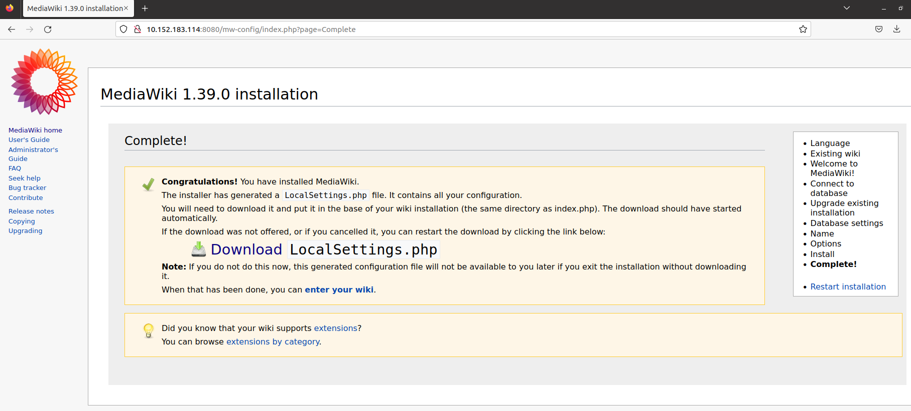

**mediawiki app**

<h3> Challenge 2</h3>

1. To deal with the resource crunch issue and ensure that POD A consumes 400 MB, POD B 200 MB and POC C 400 MB memory, so that all the pods can get the appropriate resources.

Response : If you want to bring up 3 replicas of mediwiki pod and have different memory requirements. In that case, it's not possible to define those different memory requirements as part of the same replicaset or deployment yaml.

2. MediaWiki Pod wants to access sample data stored in form of a .csv file ( You can create a sample CSV and put some max 2 rows and 2 column worth data), write a YAML script to make this .csv available to the running application pod. (We want to see where do you store the .csv file to make it accessible to the running application pod)

Response : 
- Approach 1: I have used kubectl to copy the file. 
`kubectl cp $HOME/vscode-ws/mediawiki/sample.csv mediawiki-deployment-8bfcfd475-4js9v:/var/lib/app/sample.csv`

- Approach 2: Same PVC(ReadWriteMany) can be mounted to the another Pod and can run a script to download the .csv file from the private repository. So that the .csv file is also accessible to the mediawiki app pod.

<h3> Challenge 3</h3>
Response : same configMap name can used in the deployment yaml(app/app-ConfigMap-{ENV}.yaml) But the configMap will contain values specific to env(DEV/PROD).
